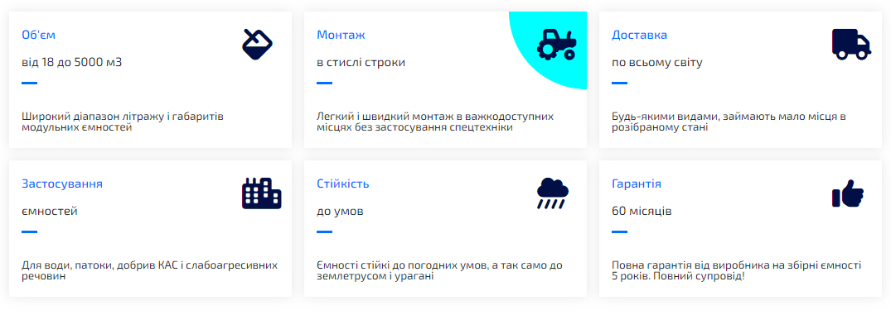

# ziko-module (real order)

[Here you can check it](https://artemuholkov.github.io/ziko-module/)

---

I didn't have figma design for this project.
This landing page is 100% responsive for all types of screens.
I used HTML, CSS, JS in this project.

---

### What was interesting in this project:

1. Casual strong main section


2. Flexbox section(blue circle appears on hover)



4. Modal window with form. Info sending to owners e-mail.


4. Sliders. Connected using CDN.


```
 <script>
      var swiper = new Swiper('.mySwiper', {
        navigation: {
          nextEl: '.swiper-button-next',
          prevEl: '.swiper-button-prev',
        },
        loop: true,
        autoplay: {
          delay: 3000,
        },
      });
    </script>
```

4. Sizes section. Correct tables appeas depends on what customer choose.


---
